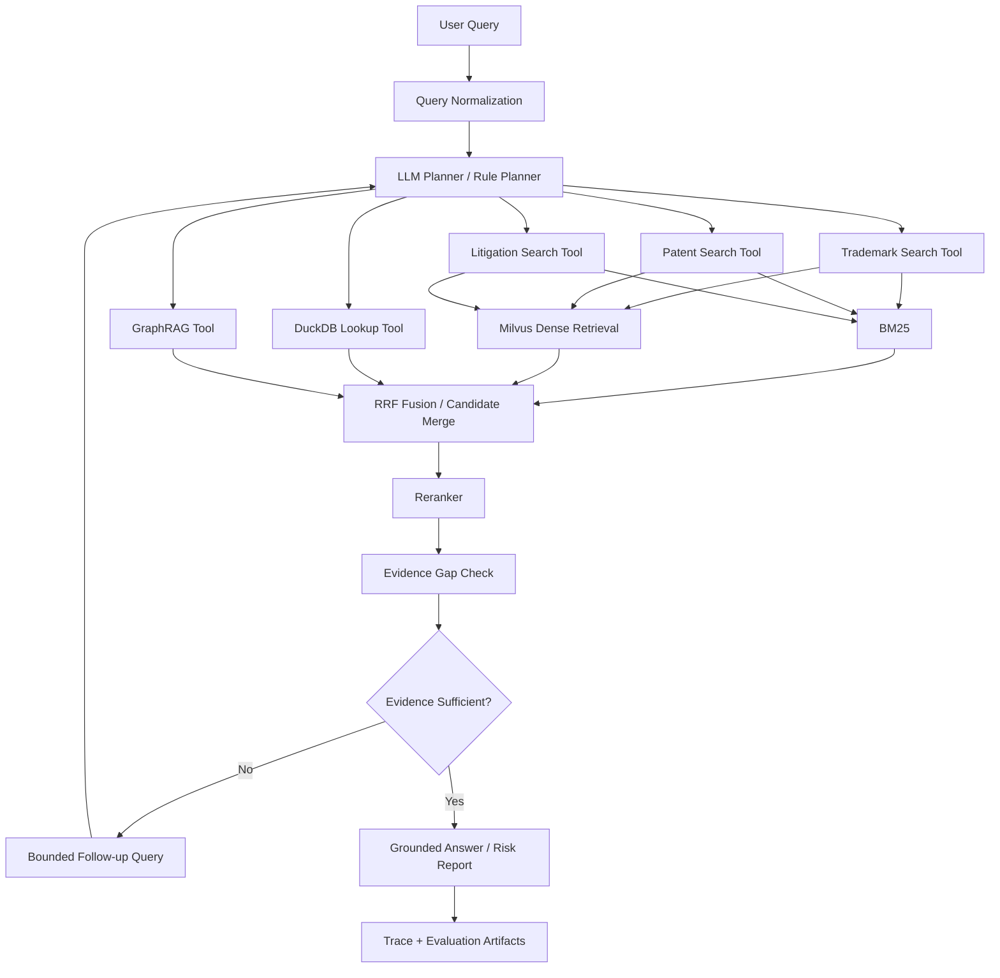

# 基于 Agentic RAG 的跨境电商知识产权风险初筛系统

本项目面向跨境电商商品上架前的知识产权风险初筛，围绕商标、专利和专利诉讼证据，构建一个可检索、可引用、可评估的 Agentic RAG 系统。它不是法律意见生成器，也不替代律师或专业代理机构的判断；它的定位是帮助卖家、选品人员、合规人员和研究人员更系统地发现证据、组织风险信号，并输出可复盘的初筛结论。

当前核心数据源是：

- USPTO trademark XML
- PatentsView patent TSV
- Patent litigation docket CSV

项目已经为图片和多模态扩展预留了 schema，例如 `ImageAsset` 和 document/chunk 级 `images` 字段，但当前主链路仍以文本证据检索为主。

---

## 1. 项目现在能做什么

当前版本已经具备以下真实可运行能力：

| 能力 | 当前状态 |
|---|---|
| XML/TSV/CSV 解析 | 支持 trademark、patent、litigation 三类核心数据源 |
| 统一证据结构 | 支持 `Document`、`EvidenceChunk`、`EvidenceHit`、`RiskScreeningReport` 等稳定对象 |
| 本地关键词检索 | 支持 BM25 |
| 结构化精确查询 | 支持 DuckDB lookup |
| GraphRAG 关系扩展 | 支持基于 NetworkX 的轻量实体关系扩展，可围绕 company、trademark、patent、case 等实体补充邻近证据 |
| 向量检索 | 支持 Milvus，需配置 embedding 和 Milvus |
| 混合检索 | 支持 `bm25_only`、`dense_only`、`hybrid_rrf`、`hybrid_rerank` |
| 重排序 | 支持 noop、lexical、本地 reranker / cross-encoder |
| Rule Agentic RAG | 支持规则路由、工具调用和证据组织 |
| LLM Agentic RAG | 支持 LLM planner、工具选择、检索模式选择、query rewrite、证据缺口检查和 bounded follow-up query |
| 单条问答 | 支持 CLI 运行 |
| 批量评估 | 支持 Rule Agentic 与 LLM Agentic 对比评估 |
| RAGAS 输入与评估 | 支持从比较结果生成 RAGAS 输入，并运行 RAGAS generation metrics |
| MCP | 提供可选 MCP server 入口和工具契约 |
| Streamlit | 当前是基础 dashboard 入口，不是在线问答入口 |
| 可观测性 | 支持本地 JSONL trace，Langfuse 作为可选 trace sink |

需要特别说明：当前“完整实验型 Agentic RAG”主要通过 CLI 和评估脚本运行；Streamlit 目前还没有接入在线问题输入、Agentic runtime 调用和答案展示。

---

## 2. 什么是本项目里的 Agentic RAG

本项目中的 Agentic RAG 不是多轮聊天机器人，而是单轮、工具规划型的证据检索工作流。系统收到一个商品或知识产权风险问题后，会在内部完成规划、检索、证据补全和回答组织。

典型流程如下：

```text
用户问题
  -> query normalization
  -> LLM planner 生成结构化计划
  -> 选择工具和每个工具的 retrieval_mode
  -> 调用 trademark / patent / litigation / DuckDB / GraphRAG 工具
  -> 汇总证据并检查 evidence gap
  -> 必要时触发 bounded follow-up query
  -> rerank / finalize evidence
  -> 生成带证据引用的回答或风险初筛报告
  -> 保存 trace 与评估字段
```

LLM 在这里负责做决策层任务：

- 判断问题类型和目标证据类型
- 选择需要调用的工具
- 为不同工具选择检索模式
- 改写查询
- 发现证据缺口
- 生成有限次数的 follow-up query

Python runtime 负责做确定性执行：

- 执行检索和 DuckDB 查询
- 控制最大迭代次数
- 合并、去重、排序证据
- 记录 trace
- 计算评估指标
- 避免把无证据回答包装成确定结论

---

## 3. 系统架构



核心模块：

| 模块 | 路径 | 说明 |
|---|---|---|
| 数据解析 | `src/crossborder_agentic_rag/ingestion/` | XML、TSV、CSV 解析和规范化 |
| 证据 schema | `src/crossborder_agentic_rag/schemas/` | 文档、证据、图片、报告、评估和 trace 契约 |
| 检索 | `src/crossborder_agentic_rag/retrieval/` | BM25、RRF、hybrid retriever、reranker |
| 存储 | `src/crossborder_agentic_rag/storage/` | DuckDB 与 Milvus 适配 |
| 实验型 Agentic RAG | `src/crossborder_agentic_rag/agents/` | LLM planner、query rewriter、LLM Agentic RAG |
| 产品型 runtime | `src/crossborder_agentic_rag/agentic/` | 报告型 runtime、dispatcher、evidence gap、runtime factory |
| MCP | `src/crossborder_agentic_rag/mcp_server/` | MCP server、tools、resources |
| Dashboard | `src/crossborder_agentic_rag/dashboard/` | Streamlit dashboard service 和页面入口 |
| 评估 | `src/crossborder_agentic_rag/evaluation/` | retrieval、answer、citation、agent、report metrics |
| 脚本入口 | `scripts/` | 数据构建、查询、对比评估、RAGAS、MCP、dashboard |

---

## 4. 检索模式和 Agent 模式

### 4.1 Pipeline mode

| 模式 | 含义 | 适用场景 |
|---|---|---|
| `basic_rag` | 直接检索并回答，不做 agentic 工具规划 | 普通 RAG baseline |
| `rule_based` | 规则型 Agentic RAG，使用确定性规则选择路线 | 稳定可复现 baseline |
| `agentic_llm` | LLM planner 驱动工具选择、检索模式选择、query rewrite 和 follow-up | 当前实验型 Agentic RAG 主模式 |
| `agentic` | 兼容旧命令，当前等价于 `rule_based` | 旧脚本兼容 |

如果要研究 Agentic RAG 的效果，建议重点比较 `rule_based` 和 `agentic_llm`。`basic_rag` 可以作为附加 baseline，但不是当前项目的主要对比对象。

### 4.2 Retrieval mode

| 模式 | 行为 |
|---|---|
| `bm25_only` | 只使用本地 BM25 关键词检索 |
| `dense_only` | 只使用 Milvus 向量检索，需要 embedding 和 Milvus |
| `hybrid_rrf` | BM25 + dense 召回后使用 RRF 融合 |
| `hybrid_rerank` | hybrid 候选召回后再进行 rerank |

在 `agentic_llm` 中，LLM planner 可以为不同工具选择不同 retrieval mode；命令行里的 `--retrieval-mode` 是默认模式和兜底模式。

---

## 5. 安装

推荐使用 `uv`：

```powershell
uv sync --all-extras --group dev
copy .env.example .env
```

如果不用 `uv`，也可以使用 pip：

```powershell
python -m venv .venv
.venv\Scripts\activate
python -m pip install -e ".[dev,dashboard,mcp,milvus,local,reranker]"
copy .env.example .env
```

常用环境变量：

| 变量 | 说明 |
|---|---|
| `LLM_PROVIDER` | `template`、`openai` 或 `openai_compatible` |
| `LLM_API_KEY` / `OPENAI_API_KEY` | LLM API key |
| `LLM_BASE_URL` / `OPENAI_BASE_URL` | OpenAI-compatible endpoint |
| `LLM_MODEL` / `OPENAI_MODEL` | LLM 模型名 |
| `EMBEDDING_PROVIDER` | `fake`、`local` 或 OpenAI-compatible embedding |
| `EMBEDDING_MODEL` | embedding 模型名或本地路径 |
| `EMBEDDING_DIM` | 向量维度 |
| `MILVUS_URI` / `RAG_MILVUS_URI` | Milvus 地址 |
| `MILVUS_COLLECTION_NAME` | Milvus collection |
| `DUCKDB_PATH` | DuckDB 文件路径 |
| `RERANKER_PROVIDER` | `noop`、`lexical`、`local`、`cross_encoder` |
| `RERANKER_MODEL` | reranker 模型名或本地路径 |

如果使用 Qwen 或其他可能默认输出 thinking trace 的 OpenAI-compatible 模型，当前 chat client 会尝试注入 `enable_thinking=false`，避免把思考过程写入最终答案。

---

## 6. 快速运行：无真实数据的 smoke test

使用内置 demo fixture 跑一条 LLM Agentic RAG：

```powershell
uv run python scripts/run_agentic_rag.py `
  --pipeline-mode agentic_llm `
  --query "Can I sell a smart suitcase with GPS tracking in the US?" `
  --retrieval-mode bm25_only `
  --demo `
  --use-llm `
  --llm-provider template `
  --output-json `
  --show-trace `
  --show-sources
```

这个命令不需要真实 LLM，也不需要 Milvus。`template` provider 用于本地 smoke run；它能验证链路结构，但不能代表真实模型效果。

---

## 7. 使用真实数据构建证据库

以下命令假设数据放在：

```text
data/raw/trademark
data/raw/patent
data/raw/litigation
```

### 7.1 解析原始数据

```powershell
uv run python scripts/01_parse_trademark_xml.py `
  --input data/raw/trademark `
  --output data/processed/trademarks.jsonl `
  --report data/processed/trademark_report.json

uv run python scripts/02_parse_patent_tsv.py `
  --input data/raw/patent `
  --output data/processed/patents.jsonl `
  --report data/processed/patent_report.json

uv run python scripts/03_parse_litigation_csv.py `
  --input data/raw/litigation `
  --output data/processed/litigation.jsonl `
  --report data/processed/litigation_report.json
```

### 7.2 合并规范化文档

PowerShell 示例：

```powershell
Get-Content @(
  "data/processed/trademarks.jsonl",
  "data/processed/patents.jsonl",
  "data/processed/litigation.jsonl"
) |
  Set-Content data/processed/ip_normalized_docs.jsonl
```

### 7.3 构建 chunk

```powershell
uv run python scripts/05_build_chunks.py `
  --input data/processed/ip_normalized_docs.jsonl `
  --output data/processed/ip_evidence_chunks.jsonl `
  --report data/processed/chunk_report.json
```

### 7.4 构建 DuckDB

```powershell
uv run python scripts/06_build_duckdb.py `
  --input data/processed/ip_normalized_docs.jsonl `
  --duckdb-path data/processed/ip_structured.duckdb `
  --report data/processed/duckdb_report.json `
  --overwrite
```

### 7.5 可选：构建 Milvus 向量索引

先做 dry run：

```powershell
uv run python scripts/07_build_milvus_index.py `
  --input data/processed/ip_evidence_chunks.jsonl `
  --dry-run `
  --report data/processed/milvus_dry_run_report.json
```

连接真实 Milvus 并写入索引：

```powershell
$env:MILVUS_URI="http://localhost:19530"
$env:MILVUS_COLLECTION_NAME="ip_chunks_qa_300k"
$env:EMBEDDING_PROVIDER="local"
$env:EMBEDDING_MODEL="C:\models\bge-base-en-v1.5"
$env:EMBEDDING_DIM="768"

uv run python scripts/07_build_milvus_index.py `
  --input data/processed/ip_evidence_chunks.jsonl `
  --collection-name ip_chunks_qa_300k `
  --embedding-provider local `
  --overwrite `
  --report data/processed/milvus_report.json
```

如果本地还没有启动 Milvus，可以先运行：

```powershell
docker compose up -d
```

注意：

- FakeEmbeddingProvider is only for tests and smoke runs.
- Real semantic retrieval requires OpenAI-compatible embeddings or local sentence-transformer embeddings.
- Dry-run mode does not insert into Milvus and should not be interpreted as successful vector indexing.
- Real Milvus mode requires a running Milvus instance, pymilvus installed, and real embeddings configured with `--embedding-provider openai-compatible` or `--embedding-provider local`.

### 7.6 兼容旧阶段脚本入口

仓库仍保留早期分阶段脚本，便于复现实验和兼容已有测试。当前 README 推荐使用上面的新入口，但以下脚本仍可按需运行：

```powershell
python scripts/01_parse_trademark_xml.py --help
python scripts/02_parse_patent_tsv.py --help
python scripts/03_parse_litigation_csv.py --help
python scripts/04_parse_policy_docs.py --help
python scripts/05_build_chunks.py --help
python scripts/06_build_duckdb.py --help
python scripts/07_build_milvus_index.py --help
python scripts/08_run_query_cli.py --help
python scripts/09_run_eval.py --help
python scripts/10_run_ablation.py --help
```

---

## 8. 运行单条 Agentic RAG 查询

### 8.1 本地 BM25 + template LLM

```powershell
uv run python scripts/run_agentic_rag.py `
  --pipeline-mode agentic_llm `
  --query "Can I sell a Huawei-like smartphone case in the US?" `
  --chunks-path data/processed/ip_evidence_chunks.jsonl `
  --duckdb-path data/processed/ip_structured.duckdb `
  --retrieval-mode bm25_only `
  --use-llm `
  --llm-provider template `
  --top-k 5 `
  --candidate-k 20 `
  --max-iterations 2 `
  --output-json `
  --show-trace `
  --show-sources
```

### 8.2 Milvus hybrid rerank + 真实 LLM

```powershell
$env:LLM_PROVIDER="openai_compatible"
$env:LLM_API_KEY="your_api_key"
$env:LLM_BASE_URL="https://your-openai-compatible-endpoint/v1"
$env:LLM_MODEL="your_model"

uv run python scripts/run_agentic_rag.py `
  --pipeline-mode agentic_llm `
  --query "Can I sell a smart suitcase with GPS tracking in the US?" `
  --chunks-path data/processed/ip_evidence_chunks.jsonl `
  --duckdb-path data/processed/ip_structured.duckdb `
  --use-milvus `
  --collection-name ip_chunks_qa_300k `
  --embedding-provider local `
  --retrieval-mode hybrid_rerank `
  --reranker-provider local `
  --reranker-model C:\models\bge-reranker-base `
  --use-llm `
  --llm-provider openai_compatible `
  --llm-model $env:LLM_MODEL `
  --llm-base-url $env:LLM_BASE_URL `
  --top-k 5 `
  --candidate-k 20 `
  --max-iterations 2 `
  --output-json `
  --show-trace `
  --show-sources
```

---

## 9. 批量评估

当前推荐用 `compare_rule_vs_agentic_online.py` 跑 Rule Agentic 与 LLM Agentic 对比。虽然脚本名包含 `compare`，它不只是对比，也会记录 agentic runtime 的多项指标。

### 9.1 smoke 评估

```powershell
uv run python scripts/compare_rule_vs_agentic_online.py `
  --queries eval/queries_small.jsonl `
  --out-dir reports/agentic_eval_smoke `
  --modes rule_based,agentic_llm `
  --retrieval-mode bm25_only `
  --demo `
  --use-llm `
  --llm-provider template `
  --limit 3
```

输出文件：

```text
reports/agentic_eval_smoke/comparison_metrics.csv
reports/agentic_eval_smoke/comparison_outputs.jsonl
reports/agentic_eval_smoke/summary.json
```

### 9.2 真实数据评估

```powershell
uv run python scripts/compare_rule_vs_agentic_online.py `
  --queries eval/queries_ip_eval_v1.jsonl `
  --out-dir reports/agentic_eval_v1 `
  --modes rule_based,agentic_llm `
  --chunks-path data/processed/ip_evidence_chunks.jsonl `
  --duckdb-path data/processed/ip_structured.duckdb `
  --use-milvus `
  --collection-name ip_chunks_qa_300k `
  --embedding-provider local `
  --retrieval-mode hybrid_rerank `
  --reranker-provider local `
  --reranker-model C:\models\bge-reranker-base `
  --use-llm `
  --llm-provider openai_compatible `
  --llm-model $env:LLM_MODEL `
  --llm-base-url $env:LLM_BASE_URL `
  --top-k 5 `
  --candidate-k 20 `
  --max-iterations 2
```

当前评估结果覆盖：

- latency：总耗时、retrieval 耗时、rerank 耗时、SQL 耗时
- retrieval：Precision@k、Recall@k、Hit@k、MRR@k、nDCG@k、MAP@k
- agent process：tool call 数、follow-up query 数、证据缺口数、最终证据数
- source coverage：最终证据是否覆盖期望 source types
- answer quality proxy：answer relevance、faithfulness、context relevance 等启发式或 LLM judge 指标
- RAGAS export fields：`ragas_user_input`、`ragas_response`、`ragas_retrieved_contexts`、`ragas_reference`

FaithfulnessProxy is a heuristic, not a human-level factuality evaluator.

---

## 10. RAGAS 评估

comparison 脚本会把 RAGAS 所需字段写入 `comparison_outputs.jsonl`，但需要先转换成 RAGAS runner 直接消费的 JSONL：

```powershell
uv run python scripts/extract_ragas_input_from_comparison.py `
  --comparison reports/agentic_eval_v1/comparison_outputs.jsonl `
  --out reports/agentic_eval_v1/ragas_input.jsonl
```

然后运行 RAGAS：

```powershell
uv run python scripts/run_ragas_eval.py `
  --eval-results reports/agentic_eval_v1/ragas_input.jsonl `
  --output reports/agentic_eval_v1/ragas_summary.json `
  --metrics faithfulness,answer_relevancy,context_precision,context_recall `
  --require-contexts
```

如果使用 Qwen 类模型并遇到 RAGAS generation 参数问题，可以使用项目中的 qwen-safe runner：

```powershell
uv run python scripts/run_ragas_generation_qwen_safe.py `
  --input reports/agentic_eval_v1/ragas_input.jsonl `
  --out-dir reports/agentic_eval_v1/ragas_qwen_safe `
  --model $env:LLM_MODEL
```

RAGAS 用于评估生成质量和上下文利用情况，不替代 retrieval metrics、citation audit 或 agentic planning 指标。

---

## 11. MCP 使用

项目提供可选 MCP server 入口：

```powershell
uv sync --extra mcp
uv run python scripts/run_mcp_server.py
```

当前 MCP server 暴露的主要能力：

- `query_ip_risk`：运行一次风险初筛 runtime，并返回 `structuredContent`
- `search_evidence`：执行证据搜索，并返回 JSON-friendly evidence hits
- `trace://{trace_id}`：读取本地 trace resource

当前 MCP 默认使用 offline template runtime，适合验证 MCP contract 和工具返回结构。若要让 MCP 直接调用实验型 `agentic_llm` 链路，需要在后续版本中把 `LLMAgenticRAG` runtime 接入 MCP runtime factory。

---

## 12. Streamlit Dashboard

安装 dashboard 依赖后可以启动 Streamlit：

```powershell
uv sync --extra dashboard
uv run streamlit run scripts/run_dashboard.py
```

当前 Streamlit 页面是基础 dashboard 入口，主要用于后续展示风险报告、评估 summary、trace 和插件状态。当前版本还没有实现：

- 页面内输入问题
- 调用 `agentic_llm` runtime
- 展示在线回答、sources、trace 和指标

所以现在需要通过 CLI 进行单条问答，通过评估脚本进行批量实验。

---

## 13. 测试与质量检查

运行单元测试、集成测试和核心质量检查：

```powershell
uv run ruff check .
uv run pytest -q
```

仓库已有测试覆盖：

- schema contracts
- XML/TSV/CSV ingestion
- chunking
- DuckDB builder
- BM25 / hybrid retrieval
- GraphRAG
- reranker
- rule-based agent workflow
- LLM planner / rewriter 相关 contract
- MCP tools
- dashboard service functions
- evaluation runner
- RAGAS eval script
- CLI contracts

对于真实 Milvus、真实 embedding、真实 LLM、Langfuse 和 RAGAS 的评估，应作为可选集成实验运行，因为这些能力依赖外部服务、模型权重和 API key。

---

## 14. 项目目录

```text
.
|-- README.md
|-- DEV_SPEC.md
|-- pyproject.toml
|-- uv.lock
|-- .env.example
|-- configs/
|   |-- agents.yaml
|   |-- app.yaml
|   |-- duckdb.yaml
|   |-- evaluation.yaml
|   |-- milvus.yaml
|   |-- paths.yaml
|   |-- plugins.yaml
|   `-- retrieval.yaml
|-- eval/
|   |-- queries_small.jsonl
|   `-- queries_ip_eval_v1.jsonl
|-- scripts/
|   |-- 01_parse_trademark_xml.py
|   |-- 02_parse_patent_tsv.py
|   |-- 03_parse_litigation_csv.py
|   |-- 05_build_chunks.py
|   |-- 06_build_duckdb.py
|   |-- 07_build_milvus_index.py
|   |-- run_agentic_rag.py
|   |-- compare_rule_vs_agentic_online.py
|   |-- extract_ragas_input_from_comparison.py
|   |-- run_ragas_eval.py
|   |-- run_mcp_server.py
|   `-- run_dashboard.py
|-- src/crossborder_agentic_rag/
|   |-- agents/
|   |-- agentic/
|   |-- config/
|   |-- dashboard/
|   |-- evaluation/
|   |-- graph/
|   |-- ingestion/
|   |-- llm/
|   |-- mcp_server/
|   |-- observability/
|   |-- retrieval/
|   |-- schemas/
|   `-- storage/
`-- tests/
```

大型原始数据、处理后数据、DuckDB 文件、Milvus 本地文件、模型权重和实验输出不应提交到 Git。推荐放在：

```text
data/raw/
data/processed/
reports/
traces/
models/
```

---

## 15. 安全边界

本项目输出的是知识产权风险初筛结果，不是法律意见。系统结论必须依赖可追溯证据，并保留不确定性和缺失证据说明。对于高风险商品、疑似侵权证据、专利权利要求解释、商标近似判断、诉讼风险判断和上架决策，应交由专业人员复核。

This system is not legal advice. Only risk_analysis answers include Risk Level.
