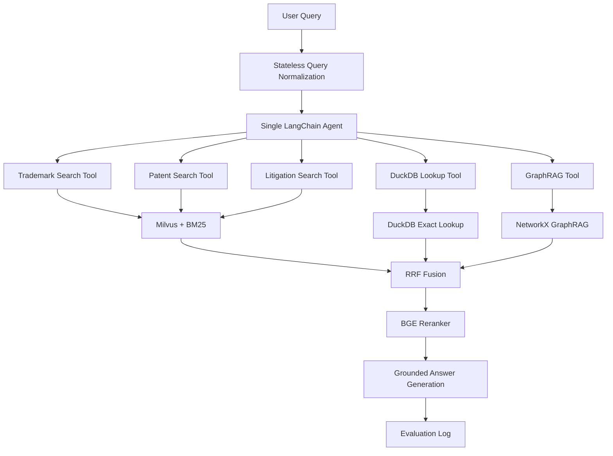

# 基于 Agentic RAG 的跨境电商知识产权风险初筛系统

This project builds a single-turn, tool-planning Agentic RAG system for preliminary cross-border e-commerce IP risk screening.

This system is not legal advice.

---

## 1. What this project does

The project is designed as a tutorial-friendly reference implementation for IP evidence retrieval and grounded QA. It helps answer questions such as:

- Trademark similarity and goods/services evidence retrieval
- Patent claim evidence retrieval
- Litigation case evidence retrieval
- Mixed IP risk assessment for cross-border e-commerce products
- Entity-relation expansion through GraphRAG
- Grounded answer generation with citations

The current scope is a **single-agent** workflow: one LangChain agent selects retrieval and lookup tools, gathers evidence, fuses/reranks results, and produces a cited answer.

---

## 2. Why Agentic RAG for IP QA?

A simple RAG pipeline is often enough for small document collections:

```text
query -> retrieve -> answer
```

Cross-border e-commerce IP QA is more demanding. A seller, analyst, or compliance reviewer may need exact identifiers, semantic matching, and entity relationships in the same question. This project therefore uses an agentic retrieval pattern:

```text
query
  -> single LangChain Agent
  -> tool selection
  -> trademark / patent / litigation / DuckDB / GraphRAG retrieval
  -> fusion
  -> rerank
  -> grounded answer
```

Why this helps:

| Need in IP QA | Example | Component used |
|---|---|---|
| Structured field lookup | registration number, serial number, Nice class, patent number, case number | DuckDB exact lookup |
| Semantic evidence search | product feature, patent claim language, litigation summary | Milvus dense retrieval + BM25 |
| Hybrid ranking | combine lexical matches and semantic matches | RRF fusion + reranking |
| Entity-relation expansion | company -> trademark -> patent -> case | NetworkX GraphRAG |
| Source-grounded response | answer with evidence references, not unsupported claims | grounded answer generation |

The goal is not to replace professional legal review. The goal is to make evidence discovery more reproducible, inspectable, and easier to evaluate.

---

## 3. Evidence sources

Current core evidence sources:

| Source | Used for |
|---|---|
| USPTO Trademark | word marks, serial / registration numbers, Nice classes, goods and services |
| PatentsView Patent Claims / Metadata | claim-level patent evidence |
| Patent Litigation Docket Reports | cases, parties, asserted patents, docket events |

Raw data, generated DuckDB files, vector indexes, Milvus databases, model weights, and large processed artifacts should stay local and should not be committed.

### Current out of scope

- Marketplace policy QA
- Temu policy QA
- Patent expiration or legal deadline calculation
- Long-term chat memory
- Multi-agent orchestration

---

## 4. System architecture



### Retrieval layers

| Layer | Purpose | Typical command or module |
|---|---|---|
| Normalized JSONL | common document format across evidence sources | parser scripts `01`-`03` |
| Chunks JSONL | retrievable evidence units | `scripts/05_build_chunks.py` |
| DuckDB | exact structured lookup | `scripts/06_build_duckdb.py` |
| BM25 | local lexical retrieval | query/eval CLIs |
| Milvus | dense vector retrieval | `scripts/07_build_milvus_index.py` |
| GraphRAG | lightweight entity-neighborhood expansion | NetworkX graph utilities |
| Reranker | second-stage ranking | lexical or local BGE reranker |

---

## 5. Repository map

```text
Agentic-RAG-CrossBorder-Marketplace/
├── README.md
├── pyproject.toml
├── .env.example
├── docker-compose.yml
├── configs/                    # paths, retrieval, Milvus, DuckDB, evaluation settings
├── eval/                       # small tracked evaluation query sets
├── scripts/                    # ingestion, indexing, query, GraphRAG, evaluation CLIs
├── src/crossborder_agentic_rag/ # package source code
└── tests/                      # unit, fixture, and pipeline tests
```

The staged core pipeline is organized around scripts `01` through `10`:

| Step | Script | Output |
|---|---|---|
| 1 | `scripts/01_parse_trademark_xml.py` | normalized trademark JSONL |
| 2 | `scripts/02_parse_patent_tsv.py` | normalized patent JSONL |
| 3 | `scripts/03_parse_litigation_csv.py` | normalized litigation JSONL |
| Compatibility | `scripts/04_parse_policy_docs.py` | optional legacy parser; not a current core evidence source |
| 4 | `scripts/05_build_chunks.py` | evidence chunks JSONL |
| 5 | `scripts/06_build_duckdb.py` | DuckDB lookup database |
| 6 | `scripts/07_build_milvus_index.py` | Milvus collection or dry-run report |
| 7 | `scripts/08_run_query_cli.py` | grounded query response |
| 8 | `scripts/09_run_eval.py` | evaluation outputs |
| 9 | `scripts/10_run_ablation.py` | ablation outputs |

`FakeEmbeddingProvider is only for tests and smoke runs`. `Real semantic retrieval requires` OpenAI-compatible embeddings or local sentence-transformer embeddings.

---

## 6. Installation

### Linux / macOS

```bash
python -m venv .venv
source .venv/bin/activate
python -m pip install -e '.[dev]'
cp .env.example .env
```

### Windows PowerShell

```powershell
python -m venv .venv
.venv\Scripts\activate
python -m pip install -e ".[dev]"
copy .env.example .env
```

### Optional extras

```bash
# Milvus support
python -m pip install -e '.[milvus]'

# Local embedding support
python -m pip install -e '.[local]'

# Local reranker support
python -m pip install -e '.[reranker]'
```

Key environment variables:

| Variable | Purpose |
|---|---|
| `EMBEDDING_PROVIDER` | selects fake, local, or OpenAI-compatible embeddings |
| `EMBEDDING_MODEL` | embedding model name/path |
| `EMBEDDING_DIM` | embedding dimensionality expected by the index |
| `RERANKER_PROVIDER` | noop, lexical, or local reranker selection |
| `MILVUS_URI` / `RAG_MILVUS_URI` | Milvus server or Milvus Lite database URI |
| `MILVUS_COLLECTION_NAME` | target vector collection |
| `DUCKDB_PATH` | structured lookup database path |
| `TRADEMARK_RAW_DIR` | local USPTO trademark source folder |
| `PATENT_RAW_DIR` | local PatentsView source folder |
| `LITIGATION_RAW_DIR` | local litigation source folder |
| `MAX_RETRIEVAL_ITERATIONS` | retrieval loop guardrail |

---

## 7. Quickstart with fixtures

Use the fixture-based end-to-end test when you want to verify the pipeline without full datasets:

```bash
pytest -q tests/test_stage8_end_to_end.py
```

For a fast repository health check:

```bash
python -m compileall -q src scripts
pytest -q
rg -n "^(<<<<<<<|=======|>>>>>>>)" -S . || true
```

---

## 8. Build the evidence pipeline

The examples below use local ignored paths under `data/processed`. Adjust paths for your environment.

### 8.1 Parse source datasets

```bash
python scripts/01_parse_trademark_xml.py \
  --input "<TRADEMARK_RAW_DIR>" \
  --output data/processed/trademarks.jsonl \
  --report data/processed/trademark_report.json

python scripts/02_parse_patent_tsv.py \
  --input "<PATENT_RAW_DIR>" \
  --output data/processed/patents.jsonl \
  --report data/processed/patent_report.json

python scripts/03_parse_litigation_csv.py \
  --input "<LITIGATION_RAW_DIR>" \
  --output data/processed/litigation.jsonl \
  --report data/processed/litigation_report.json
```

### 8.2 Optional compatibility parser

The repository still contains a compatibility parser for legacy policy documents, but marketplace policy and Temu policy are not current core evidence sources for this README scope. Do not include this output in the default trademark/patent/litigation pipeline unless you are intentionally running a separate compatibility experiment.

```bash
python scripts/04_parse_policy_docs.py \
  --input "<OPTIONAL_POLICY_RAW_DIR>" \
  --output data/processed/policies.jsonl \
  --report data/processed/policy_report.json
```

### 8.3 Combine normalized records

```bash
cat \
  data/processed/trademarks.jsonl \
  data/processed/patents.jsonl \
  data/processed/litigation.jsonl \
  > data/processed/all_docs.jsonl
```

### 8.4 Build chunks and structured lookup

```bash
python scripts/05_build_chunks.py \
  --input data/processed/all_docs.jsonl \
  --output data/processed/chunks.jsonl \
  --report data/processed/chunk_report.json

python scripts/06_build_duckdb.py \
  --input data/processed/all_docs.jsonl \
  --duckdb-path data/processed/ip.duckdb \
  --report data/processed/duckdb_report.json \
  --overwrite
```

### 8.5 Validate Milvus input with dry-run mode

```bash
python scripts/07_build_milvus_index.py \
  --input data/processed/chunks.jsonl \
  --dry-run \
  --report data/processed/milvus_report.json
```

Dry-run mode does not insert into Milvus and should not be interpreted as successful vector indexing.

### 8.6 Build a real Milvus index

```bash
docker compose up -d

python scripts/07_build_milvus_index.py \
  --input data/processed/chunks.jsonl \
  --collection-name ip_chunks \
  --embedding-provider local \
  --overwrite \
  --report data/processed/milvus_report.json
```

Real Milvus mode requires a running Milvus instance, pymilvus installed, and real embeddings configured with `--embedding-provider openai-compatible` or `--embedding-provider local`.

---

## 9. Run queries

### Single query CLI

Only risk_analysis answers include Risk Level. Other answer types should be read as evidence-focused responses rather than overall risk classifications.

```bash
python scripts/query.py "Can I sell this phone case in the US?" --target-market US --scope trademark --output-json
```

### Stable workflows

```bash
python scripts/query.py "Can I sell this phone case in the US?" --target-market US --output-json
python scripts/evaluate.py --eval-file eval/queries_small.jsonl --output-dir reports/eval/demo
python scripts/run_mcp_server.py --help
python scripts/run_dashboard.py --help
```

```bash
python scripts/08_run_query_cli.py \
  "Which Nice classes are associated with the queried trademark evidence?" \
  --duckdb-path data/processed/ip.duckdb \
  --chunks-path data/processed/chunks.jsonl \
  --output-json
```

```bash
python scripts/08_run_query_cli.py \
  "Summarize litigation evidence for an asserted patent." \
  --duckdb-path data/processed/ip.duckdb \
  --chunks-path data/processed/chunks.jsonl \
  --output-json
```

### BM25-only query without Milvus

```bash
python scripts/run_hybrid_query.py \
  --query "smart travel bag trademark and patent risk" \
  --mode bm25_only \
  --top-k 10
```

### Hybrid RRF query

```bash
python scripts/run_hybrid_query.py \
  --query "What IP risks should a seller review for a smart travel bag product?" \
  --mode hybrid_rrf \
  --top-k 10 \
  --output-json
```

### Hybrid rerank query

```bash
python scripts/run_hybrid_query.py \
  --query "What patent claim evidence is relevant to drone delivery control?" \
  --mode hybrid_rerank \
  --reranker-provider lexical \
  --candidate-k 50 \
  --top-k 8 \
  --output-json
```

---

## 10. GraphRAG

The GraphRAG layer is intentionally lightweight. It uses a NetworkX graph to expand from entities such as companies, trademarks, patents, and litigation cases to nearby evidence. This is useful when the query mentions one entity but relevant evidence is connected through another entity.

Typical pattern:

```text
entity mention -> graph lookup -> neighboring entities/evidence -> fusion with text retrieval -> reranked evidence
```

Use GraphRAG as an evidence-expansion layer, not as a source of unsupported legal conclusions.

---

## 11. Evaluation and ablation

This repository includes evaluation scripts and small tracked query sets for reproducible experiments. If you do not have a full labeled benchmark yet, treat the outputs as pipeline diagnostics rather than final claims about model quality.

### Retrieval evaluation

```bash
python scripts/eval_retrieval.py \
  --eval-path eval/queries_small.jsonl \
  --chunks-path data/processed/chunks.jsonl \
  --modes bm25_only,hybrid_rrf,hybrid_rerank \
  --top-k-values 5,8,10 \
  --candidate-k 50 \
  --reranker-provider lexical \
  --output-dir reports/eval_retrieval
```

Tracked or planned metrics include:

| Metric | Meaning |
|---|---|
| `Precision@k` | fraction of retrieved evidence judged relevant |
| `Recall@k` | fraction of expected relevant evidence retrieved |
| `HitRate@k` | whether at least one relevant item appears in top-k |
| `MRR@k` | reciprocal rank of first relevant item |
| `nDCG@k` | ranking quality with graded or weak relevance labels |
| `CitationCoverage` | share of final evidence referenced by the answer |
| `ValidCitationRate` | share of cited evidence IDs that exist in the evidence manifest |

No fixed Recall@k, nDCG, latency, or accuracy numbers are claimed in this README. Run the evaluation scripts on your own processed data and labeled query set before reporting results.

### Agentic vs basic baseline

```bash
python scripts/eval_agent_vs_basic.py \
  --eval-path eval/queries_small.jsonl \
  --pipeline-modes basic_rag,agentic \
  --retrieval-mode hybrid_rerank \
  --reranker-provider lexical \
  --candidate-k 50 \
  --top-k 8 \
  --output-dir reports/eval_agent_vs_basic_no_llm
```

### Stage evaluation

```bash
python scripts/09_run_eval.py \
  --eval-file tests/fixtures/e2e/eval/eval_queries.jsonl \
  --output-dir data/eval \
  --duckdb-path data/processed/ip.duckdb \
  --chunks-path data/processed/chunks.jsonl
```

### Ablation

```bash
python scripts/10_run_ablation.py \
  --eval-file tests/fixtures/e2e/eval/eval_queries.jsonl \
  --output-dir data/eval/ablation \
  --duckdb-path data/processed/ip.duckdb \
  --chunks-path data/processed/chunks.jsonl \
  --experiments bm25_only,hybrid_rrf,no_reranker
```

FaithfulnessProxy is a heuristic, not a human-level factuality evaluator.

---

## 12. Real-data readiness checklist

Before running on full datasets:

- [ ] Install the required optional extras for your chosen retrieval mode.
- [ ] Set local paths for `TRADEMARK_RAW_DIR`, `PATENT_RAW_DIR`, and `LITIGATION_RAW_DIR`.
- [ ] Parse trademark, patent, and litigation sources into normalized JSONL.
- [ ] Inspect parser reports for missing identifiers, empty text, or unexpected schemas.
- [ ] Combine normalized records into `all_docs.jsonl`.
- [ ] Build chunks and inspect the chunk report.
- [ ] Build DuckDB and verify exact lookups.
- [ ] Run Milvus dry-run mode to validate chunk loading and embedding dimensions.
- [ ] Start Milvus and build a real vector index with real embeddings.
- [ ] Run representative queries and inspect citations.
- [ ] Run evaluation and ablation on labeled or weak-labeled queries.

---

## 13. Troubleshooting

| Symptom | What to check |
|---|---|
| Dense retrieval returns poor matches | Confirm you are not using fake embeddings. Fake embeddings are only for smoke runs. |
| Milvus indexing appears to work but no vectors are searchable | Confirm you did not only run dry-run mode. Dry-run mode does not insert into Milvus. |
| Milvus connection fails | Start the service with `docker compose up -d`, verify URI, and install `pymilvus`. |
| Local reranker fails to import | Use `--reranker-provider lexical` or install local reranker dependencies. |
| Exact lookup misses known IDs | Inspect normalized JSONL fields and rebuild DuckDB. |
| Evaluation metrics are `None` or sparse | Add stronger labels or expected IDs to the evaluation query file. |
| Answers sound too definitive | Treat generated output as evidence summaries only; this system is not legal advice. |

---

## 14. Known limitations

- The system is designed for evidence retrieval and grounded QA, not legal representation or final legal conclusions.
- Trademark XML field coverage may need expansion for additional USPTO variants.
- Patent TSV column variants are handled best-effort and may need adaptation for unseen releases.
- Litigation data normalization depends on the shape and completeness of docket reports.
- Fake embeddings are not semantic and should not be used for real retrieval quality assessment.
- Milvus real mode requires external service availability and compatible embedding dimensions.
- GraphRAG expansion depends on extracted entity quality and graph construction choices.
- Reranker quality depends on the selected provider and model.
- Evaluation quality depends on the availability of reliable relevance labels.
- FaithfulnessProxy is a heuristic and is not a substitute for human review.

---

## 15. Safety and interpretation

Use this project to organize and retrieve evidence from trademark, patent, and litigation sources. Do not treat the generated answers as legal opinions. Important business or legal decisions should be reviewed by qualified professionals using the cited source material.
